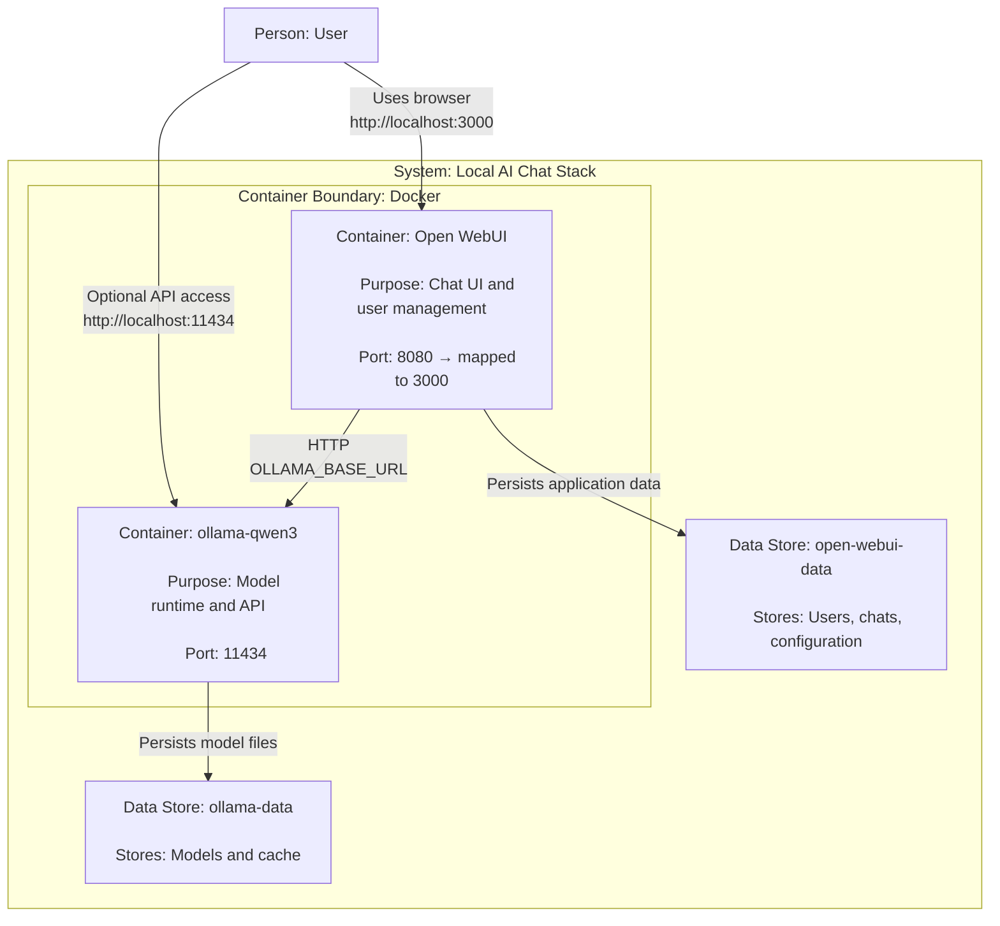

# Open WebUI + Ollama + Qwen3 with Docker Compose


Local stack to run **Ollama (custom image with Qwen3 preloaded)** and **Open WebUI**
using **Docker Compose**.

This setup provides a ready-to-use local AI chat environment without downloading
models at runtime.

---

## Quick architecture

- **ollama-qwen3** → Ollama runtime with model `qwen3:4b` preloaded  
  API available at `http://localhost:11434`
- **open-webui** → Web-based chat interface available at `http://localhost:3000`



---

## Requirements

- Docker (Docker Desktop on macOS)
- Docker Compose v2 (`docker compose`)
- Free ports:
  - `11434` (Ollama + Qwen3 API)
  - `3000` (Open WebUI)

---

## Installation

### Install Docker

**Fedora / RHEL / CentOS**
```bash
sudo dnf install -y docker
sudo systemctl enable --now docker
```

**Ubuntu / Debian**
```bash
sudo apt update && sudo apt install -y docker.io
```

**macOS**
```bash
brew install --cask docker
```

Verify installation:
```bash
docker --version
docker compose version
```

---

## Configuration

Create a `.env` file in the same directory as `docker-compose.yaml`:

```env
WEBUI_SECRET_KEY=change-me-to-a-long-random-secret
ENABLE_SIGNUP=true
```

Generate a secure secret:
```bash
openssl rand -hex 32
```

---

## Execution

From the project directory:

```bash
docker compose up -d
```

Access:
- Open WebUI → http://localhost:3000
- Ollama API → http://localhost:11434

> On first access, Open WebUI will ask you to create the first user (admin). This is expected behavior.

---

## Testing and validation

### Verify Ollama
```bash
curl http://localhost:11434
```

Expected response:
```
Ollama is running
```

### List models
```bash
curl http://localhost:11434/api/tags
```

### Validate Open WebUI
Open in the browser:
```
http://localhost:3000
```

Create a user, log in, and test a chat with the model.

### Logs
```bash
docker logs ollama-qwen3
docker logs open-webui
```

---

## Stop and restart

### Stop
```bash
docker compose stop
```

### Start again
```bash
docker compose start
```

---

## Teardown

### Bring down containers (keeps data)
```bash
docker compose down
```

### Full cleanup (⚠️ removes volumes)
```bash
docker compose down -v
```

This removes:
- Downloaded models (Ollama)
- Users and conversations (Open WebUI)

---

## Image source

```
ghcr.io/r3xakead0/qwen3-container/ollama-qwen3:latest
```

---

## Security recommendations

- Change `WEBUI_SECRET_KEY` to a long, random secret
- After creating the first user, disable signups:
  ```env
  ENABLE_SIGNUP=false
  ```
  then recreate containers:
  ```bash
  docker compose up -d --force-recreate
  ```

---

## Expected final state

- Ollama responding on `localhost:11434`
- Open WebUI accessible on `localhost:3000`
- Model available and functional

---

## Third-party components

This project uses the following open-source components:

- **Ollama** – MIT License  
  https://github.com/ollama/ollama

- **Open WebUI** – MIT License  
  https://github.com/open-webui/open-webui

- **Buildah** – Apache License 2.0  
  https://github.com/containers/buildah

- **Docker / Docker Compose** – Apache License 2.0  
  https://www.docker.com/

---

## License

This project is licensed under the MIT License.
See the [LICENSE](LICENSE) file for details.
