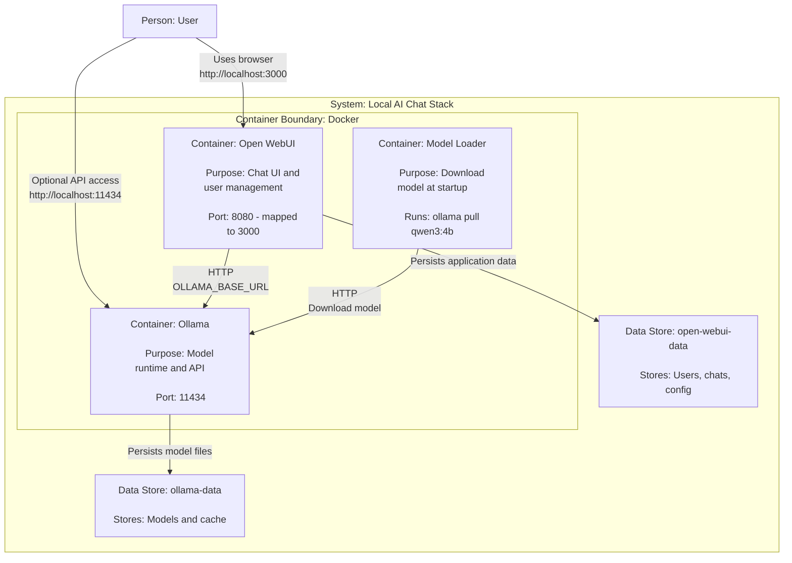

# Ollama + Open WebUI + Qwen3 with Docker Compose

Local stack to run **Ollama** (model server) + **Open WebUI** (chat-style web interface) using **Docker Compose**.

---

## Quick architecture

- **ollama** → Model API at `http://localhost:11434`
- **open-webui** → Web interface at `http://localhost:3000`
- **model-loader** → One-shot container that downloads the `qwen3:4b` model and then exits



---

## Requirements

- Docker and Docker Compose
- Free ports:
  - `11434` (Ollama)
  - `3000` (Open WebUI)

---

## 1) Installation

### 1.1 Install Docker

**Fedora / RHEL / CentOS**
```bash
sudo dnf install -y docker
sudo systemctl enable --now docker
```

**Ubuntu / Debian**
```bash
sudo apt update && sudo apt install -y docker.io
```

**macOS**
```bash
brew install --cask docker
```

Verify:
```bash
docker --version
docker compose version
```

---

## 2) Configuration

Create a `.env` file in the same directory as `docker-compose.yaml`:

```env
WEBUI_SECRET_KEY=change-me-to-a-long-random-secret
ENABLE_SIGNUP=true
MODEL_NAME=qwen3:8b
```

Generate a secure secret:
```bash
openssl rand -hex 32
```

---

## 3) Execution

From the project directory:

```bash
docker compose up -d
```

Check status:
```bash
docker ps
docker compose ps
```

Access:
- Open WebUI → http://localhost:3000
- Ollama API → http://localhost:11434

> On first access, Open WebUI will ask you to create the first user (admin). This is expected behavior.

---

## 4) Testing and validation

### 4.1 Verify Ollama
```bash
curl http://localhost:11434
```

Expected response:
```
Ollama is running
```

---

### 4.2 List models
```bash
curl http://localhost:11434/api/tags
```

---

### 4.3 Validate Open WebUI
Open in the browser:
```
http://localhost:3000
```

Create a user, log in, and test a chat with the model.

---

### 4.4 Logs
```bash
docker logs ollama-qwen3
docker logs open-webui
docker logs model-loader-qwen3
```

---

## 5) Stop and restart

### Stop
```bash
docker compose stop
```

### Start again
```bash
docker compose start
```

---

## 6) Teardown

### 6.1 Bring down containers (keeps data)
```bash
docker compose down
```

### 6.2 Full cleanup (⚠️ removes volumes)
```bash
docker compose down -v
```

This removes:
- Downloaded models (Ollama)
- Users and conversations (Open WebUI)

---

## Security recommendations

- Change `WEBUI_SECRET_KEY` to a long, random secret
- After creating the first user, disable signups:
  ```env
  ENABLE_SIGNUP=false
  ```
  then recreate containers:
  ```bash
  docker compose up -d --force-recreate
  ```

---

## Expected final state

- Ollama responding on `localhost:11434`
- Open WebUI accessible on `localhost:3000`
- Model available and functional
